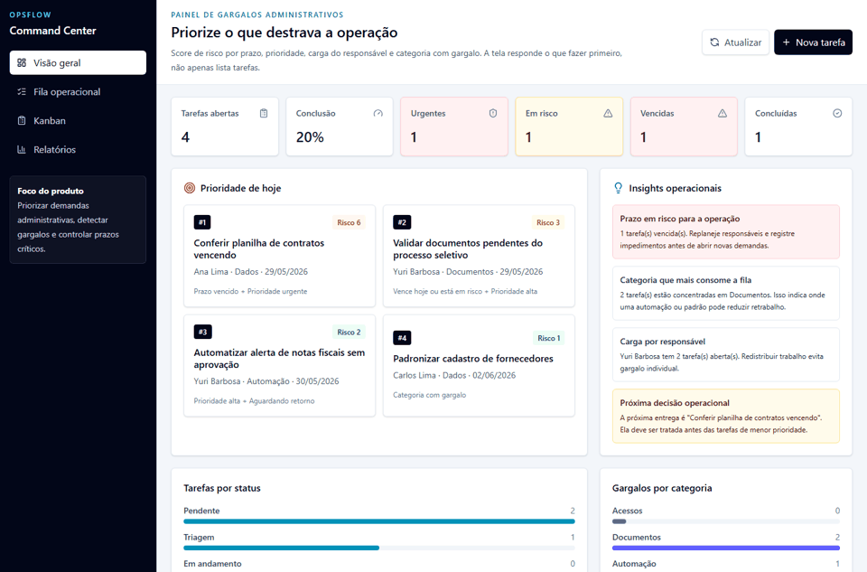
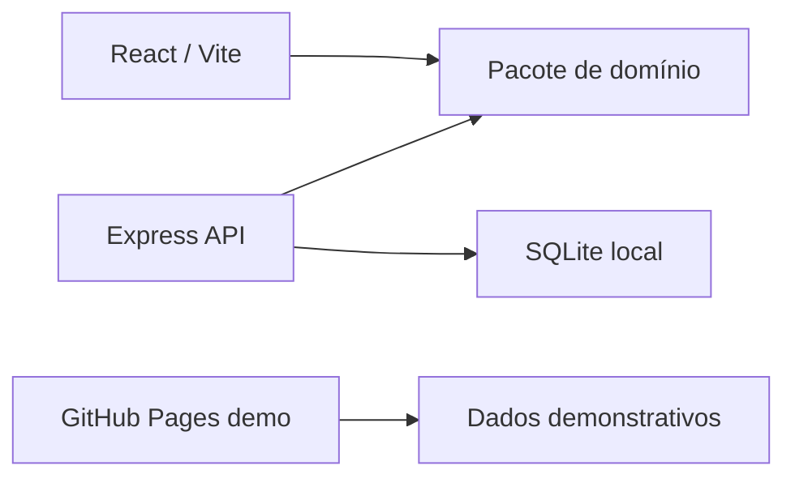

# OpsFlow Administrativo


Sistema full stack para priorizar demandas administrativas, detectar gargalos e controlar prazos críticos.

[Demo online](https://yuribarbosa384-bot.github.io/opsflow-service-desk/) · [Repositório](https://github.com/yuribarbosa384-bot/opsflow-service-desk)




## Problema

Equipes administrativas costumam acompanhar documentos, contratos, acessos, aprovações e relatórios em planilhas ou mensagens soltas. Isso dificulta responder perguntas simples:

- O que está vencido?
- Quem está sobrecarregado?
- Qual categoria está travando a operação?
- Qual tarefa precisa ser feita primeiro?

O OpsFlow organiza esse fluxo em um Command Center com dashboard, score de risco, fila operacional, Kanban, relatórios e ações de criação, edição e exclusão.

## Funcionalidades

- Dashboard com tarefas abertas, conclusão, urgentes, vencidas e em risco
- Prioridade automática por score de risco
- Filtros por busca, status, prioridade, categoria, responsável, mês e prazo
- URL compartilhável para filtros ativos
- Chips de filtros ativos e ação para limpar filtros
- Fila operacional com painel lateral de detalhe
- Kanban por etapa do fluxo
- Relatórios simples por status, categoria e responsável
- Exportação CSV da fila filtrada
- CRUD completo de tarefas
- Confirmação antes de excluir
- Demo pública com dados demonstrativos
- API local com Express, validação Zod e banco SQLite

## Regra de negócio

O score de risco considera:

- prazo vencido ou vencendo hoje
- prioridade urgente ou alta
- responsável com alta carga
- categoria com gargalo
- tarefas aguardando retorno

Essa regra transforma a aplicação em um painel de decisão, não apenas uma lista de tarefas.

## Stack

- React 19, TypeScript, Vite e Tailwind CSS
- Express 5 com API REST
- SQLite local usando `node:sqlite`
- Zod para contratos e validação
- Vitest, Testing Library e Supertest
- GitHub Actions para CI e deploy no GitHub Pages
- Monorepo com web, API e pacote de domínio compartilhado

## Arquitetura



Decisão técnica documentada: [ADR-001](docs/ADR-001-command-center-architecture.md).

Guia de demo, GitHub Pages, API local e ngrok: [docs/DEPLOYMENT_GUIDE.md](docs/DEPLOYMENT_GUIDE.md).

## Como rodar

Requisito: Node.js 24 ou superior.

```bash
npm install
npm run dev
```

URLs locais:

- Web: http://127.0.0.1:5173
- API: http://127.0.0.1:3333
- Healthcheck: http://127.0.0.1:3333/health

A demo online roda como frontend estático com dados demonstrativos. Para avaliar API, SQLite e persistência, rode o projeto localmente.

## Scripts

```bash
npm run typecheck
npm run test
npm run test:e2e
npm run build
```

## Qualidade e segurança

- CI com typecheck, testes e build em `main` e pull requests
- Playwright E2E cobrindo criação, filtro, edição e exclusão de tarefa
- Deploy automatizado do frontend estático no GitHub Pages
- CodeQL para análise estática de JavaScript e TypeScript
- Dependabot para npm e GitHub Actions
- Dependency Review para revisar mudanças de dependências em pull requests
- Release notes em [docs/RELEASE_NOTES.md](docs/RELEASE_NOTES.md)

## API

```text
GET     /health
GET     /api/analytics
GET     /api/insights
GET     /api/tickets
GET     /api/tickets/:id
POST    /api/tickets
PUT     /api/tickets/:id
PATCH   /api/tickets/:id/status
DELETE  /api/tickets/:id
```

Filtros disponíveis em `GET /api/tickets`:

```text
q
status
priority
category
assignee
month
due
```

## O que este projeto demonstra

- Modelagem de domínio com tipos e validação compartilhados
- Banco SQLite com seed, índices e persistência local
- API REST com contratos, filtros, métricas, insights e tratamento de erros
- Interface responsiva com dashboard, fila, Kanban, relatórios e painel de detalhe
- Testes de regra de negócio, API e formulário
- CI com typecheck, testes e build
- Deploy estático com GitHub Pages
- Filtros compartilháveis e exportação CSV para aproximar o projeto de uma rotina administrativa real

## Evoluções planejadas

- Histórico de eventos por tarefa
- Comentários internos
- Autenticação e perfis de acesso
- Exportação CSV
- Backend publicado em Render, Railway ou Fly.io
- Testes end-to-end
