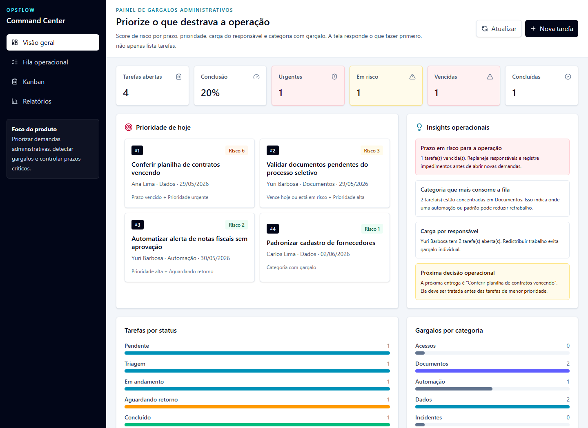

# OpsFlow Service Desk

Sistema full-stack de service desk operacional para controlar chamados, prioridade, SLA e status de atendimento.

O projeto foi desenhado para portfolio: ele mostra produto funcionando, regras de negocio, API, validacao, testes automatizados, CI e documentacao de decisao tecnica.

Repositorio: https://github.com/yuribarbosa384-bot/opsflow-service-desk



## Problema

Equipes administrativas e operacionais costumam acompanhar demandas em planilhas, mensagens soltas e controles paralelos. O OpsFlow centraliza a fila de chamados e ajuda a priorizar o que esta urgente, vencido ou em risco.

## Stack

- React 19, TypeScript, Vite e Tailwind CSS
- Express 5 com API REST
- Zod para contratos e validacao
- Vitest, Testing Library e Supertest
- GitHub Actions para CI
- Persistencia local em JSON para evitar dependencia de Docker no primeiro ciclo

## O que este projeto demonstra

- Modelagem de dominio com tipos e validacao compartilhados
- API com rotas, filtros, criacao e atualizacao de status
- Interface responsiva com dashboard, filtros, tabela e painel de detalhe
- Testes de regra de negocio, API e formulario
- Documentacao de produto, decisoes tecnicas e roadmap
- Estrutura de monorepo com apps e pacote compartilhado

## Como rodar

```bash
npm install
npm run dev
```

URLs locais:

- Web: http://127.0.0.1:5173
- API: http://127.0.0.1:3333
- Healthcheck: http://127.0.0.1:3333/health

## Scripts

```bash
npm run typecheck
npm run test
npm run build
```

## API

```text
GET    /health
GET    /api/analytics
GET    /api/tickets
GET    /api/tickets/:id
POST   /api/tickets
PATCH  /api/tickets/:id/status
```

Filtros disponiveis em `GET /api/tickets`:

```text
q
status
priority
category
```

## Case study

### Contexto

O projeto parte de uma dor comum em rotinas administrativas: acompanhar documentos, contratos, acessos e tarefas internas sem perder prazo.

### Decisoes principais

- O dominio fica em `packages/domain` para que API e web usem as mesmas regras.
- A API valida entrada com Zod antes de persistir dados.
- A interface prioriza leitura rapida, status e SLA, porque o usuario operacional precisa decidir rapido.
- A persistencia local em JSON foi escolhida para manter o projeto simples de executar por recrutadores.

### Evolucoes planejadas

- Autenticacao por usuario e perfis de acesso
- Banco SQLite ou Postgres
- Historico de eventos por chamado
- Deploy da web e API
- Screenshots do produto no README

## Referencias usadas como criterio de qualidade

- GitHub Docs: READMEs ajudam visitantes a entenderem rapidamente o que o projeto faz e como usar.
- GitHub Docs: GitHub Actions executa automacoes de build e teste em eventos do repositorio.
- React Docs: componentes devem representar estados de UI claros e previsiveis.
- Testing Library: testes devem se aproximar da forma como usuarios interagem com a interface.
- MDN: formularios e HTML semantico melhoram acessibilidade e manutencao.
