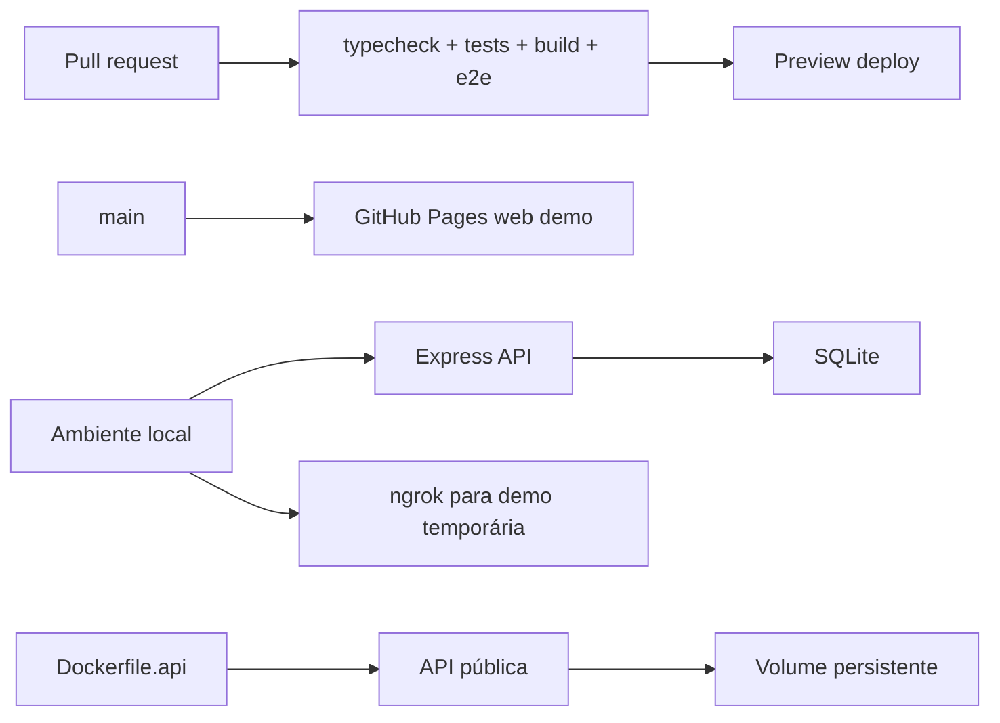

# Deployment guide

Este guia resume o caminho sugerido no plano de portfólio: remover fricção de demo, manter validação automática e preparar o projeto para ambientes de avaliação.

## Estratégia



## Web pública

A demo web estática é publicada no GitHub Pages:

- URL: https://yuribarbosacouto.github.io/opsflow-service-desk/
- Workflow: `.github/workflows/pages.yml`
- Modo: `github-pages`, usando dados demonstrativos versionados

## API local

Para avaliar API, banco e persistência:

```bash
npm install
npm run dev
```

URLs:

- Web local: http://127.0.0.1:5173
- API local: http://127.0.0.1:3333
- Healthcheck: http://127.0.0.1:3333/health

## API em Docker

O backend já possui `Dockerfile.api` para deploy em serviços que aceitam container, como Render, Railway ou Fly.io.

Build local:

```bash
docker build -f Dockerfile.api -t opsflow-api .
```

Execução local com volume persistente:

```bash
docker run --rm -p 3333:3333 -v opsflow-data:/data opsflow-api
```

Variáveis suportadas:

```text
PORT=3333
OPSFLOW_DB_PATH=/data/opsflow.sqlite
OPSFLOW_SEED_PATH=/app/apps/api/data/tickets.seed.json
```

Para produção, use volume persistente no caminho `/data`; sem volume, o SQLite funciona, mas os dados podem ser perdidos quando o container reiniciar.

## Demo temporária com ngrok

Use quando for necessário mostrar o ambiente local com API real:

```bash
ngrok http 5173
ngrok http 3333
```

Para a web consumir a API externa, defina `VITE_API_URL` apontando para a URL pública da API.

## Próximo deploy de backend

O próximo passo recomendado é publicar a API com `Dockerfile.api` em Render, Railway ou Fly.io usando volume persistente. A demo estática já reduz a fricção inicial, mas uma API pública completa demonstraria persistência real fora da máquina local.
